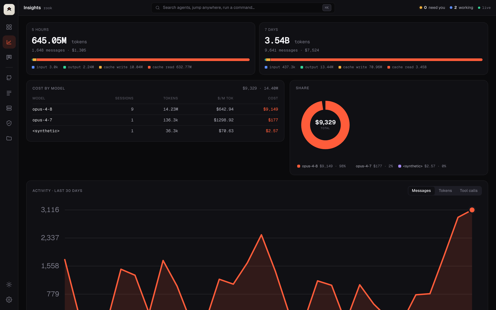
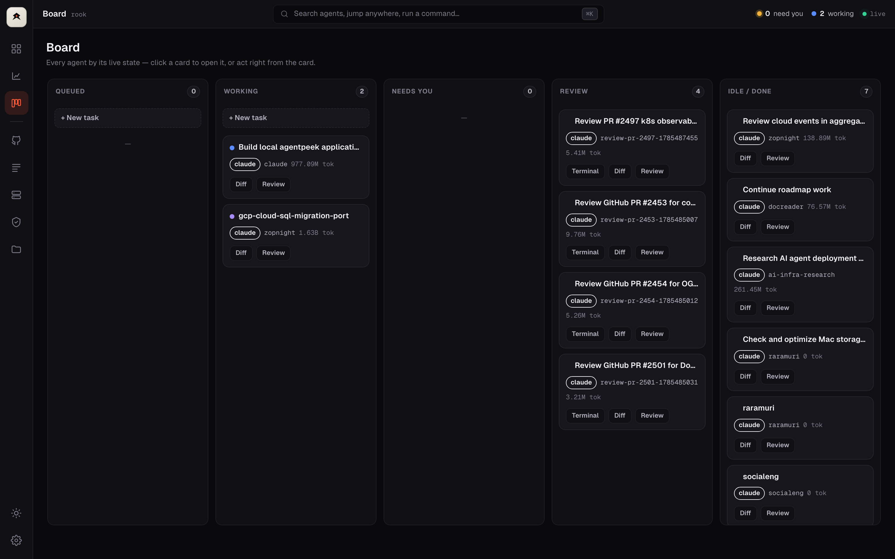
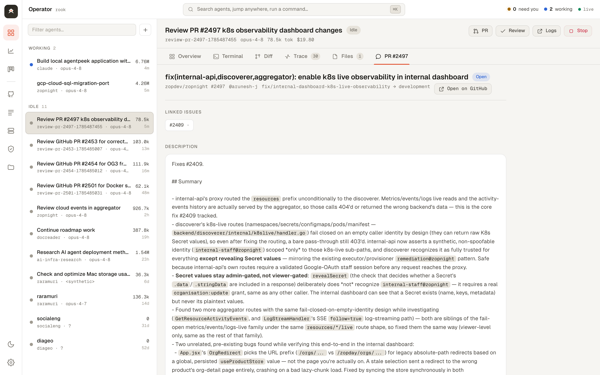

<div align="center">


### One screen to watch and drive all your AI coding agents

rook is a small, self-hosted dashboard that keeps an eye on every AI coding agent
running on your machine — **Claude Code, Codex, Aider, Gemini** — and pulls you in
the moment one needs you. It runs entirely on `localhost`.

<br />

[](LICENSE)
[](go.mod)
[](#-your-machine-your-data)
[](CONTRIBUTING.md)
[](#-what-you-need)

<br />

**[Quick start](#-quick-start)** &nbsp;·&nbsp; **[Features](docs/FEATURES.md)** &nbsp;·&nbsp; **[Setup &amp; usage](docs/USAGE.md)** &nbsp;·&nbsp; **[For AI agents](AGENTS.md)** &nbsp;·&nbsp; **[Contributing](CONTRIBUTING.md)**

</div>

<br />


<div align="center"><sub><b>The Operator console</b> — your live agent roster on the left, the selected agent's full workspace on the right.</sub></div>

<br />

---

## What is rook?

If you run more than one coding agent at a time, you lose the thread. One is stuck
on a permission prompt, another finished ten minutes ago, a third is quietly
burning tokens on the wrong thing — and you're flipping through terminal tabs to
find out which is which.

**rook is one pane of glass over all of them.** Open it in your browser and you see
every agent, what it's doing, and which ones are waiting on you — with the controls
to act right there: approve a prompt, reply, jump into the live terminal, review
the diff, or read the PR it's working on.

It's **local-first and single-user**. Nothing leaves your machine, and GitHub stays
read-only until you explicitly turn on write actions.

<br />

## Why you'll want it

<table>
<tr>
<td width="50%" valign="top">

### 🔔 Never miss a waiting agent
A live "needs you" count with Allow / Deny / reply right in the workspace — or drop
into the agent's real terminal, embedded through tmux.

</td>
<td width="50%" valign="top">

### 🧠 See what an agent is actually doing
A context-window gauge (how full it is), token and cost totals, a tool-usage mix,
an execution-trace waterfall, and its live diff.

</td>
</tr>
<tr>
<td width="50%" valign="top">

### 🔗 Full PR &amp; issue context, in-app
Description, commits, linked issues, reviews, and comments for the PR an agent is
reviewing — pulled live from GitHub, no tab-switching.

</td>
<td width="50%" valign="top">

### 💬 Review comments that reach the agent
Leave inline comments on the diff. rook tracks each as a thread — **open → sent →
addressed** — and routes them straight to the agent's terminal.

</td>
</tr>
<tr>
<td width="50%" valign="top">

### ⚡ Start work without typing paths
Hand rook a GitHub / Linear / Jira ticket; it fetches the ticket, writes the task,
and auto-resolves the local checkout. Launch agents that automatically **follow
your repo's `AGENTS.md` / `CLAUDE.md`**.

</td>
<td width="50%" valign="top">

### 💸 Know where your tokens go
5-hour and 7-day windows with input/cache breakdown, cost by model and by project,
and a 30-day trend. Route low-stakes work to cheaper models.

</td>
</tr>
<tr>
<td width="50%" valign="top">

### ↻ Reopen anything you closed
Closed a session by mistake? rook remembers every past session and can **resume it
with full context** — same conversation, same history.

</td>
<td width="50%" valign="top">

### 📝 Daily work summaries
Generate a summary of everything you and your agents did in a day — across every
project, plus all your GitHub contributions.

</td>
</tr>
</table>

Dark **and** light themes, fully keyboard-driven, with a **⌘K** command palette for
everything. → **[See the full feature guide](docs/FEATURES.md)**

<br />

## Why the name "rook"?

The **rook** is the castle — the tower — on a chessboard. From one fixed square it
commands whole **ranks and files**, controlling every open lane at once. That's the
job here: rook is your tower over the board of agents, a single vantage point that
sees down every lane of work and lets you move on any of them. Short, one syllable,
and it makes a good thing to type: `rook`.

<br />

## 📸 A look around

| | |
|:--:|:--:|
| [](docs/img/insights.png) | [](docs/img/board.png) |
| **Insights** — usage, cost by model &amp; project, 30-day trend | **Board** — every agent by its live state |
| [](docs/img/diff.png) | [](docs/img/pr-context.png) |
| **Diff review** — file tree, split/unified, inline comments | **PR / issue context** — description, commits, comments |

<div align="center">

[](docs/img/light.png)

<sub>Light theme — toggle it from the rail; your choice is remembered.</sub>

</div>

<br />

## 🤖 Supported agents

| Agent | Monitoring | Control (via tmux) |
|-------|:---------:|:------------------:|
| **Claude Code** | ✅ stable | ✅ |
| Codex | 🧪 beta | ✅ |
| Aider | 🧪 beta | ✅ |
| Gemini | 🧪 beta | ✅ |

**Monitoring** works for any agent that writes session transcripts to disk — rook
picks them up automatically. **Control** (Allow/Deny, live terminal, launching new
agents) needs the agent to run inside a `tmux` session.

<br />

## 🧰 What you need

| Tool | For | Install (macOS) |
|------|-----|-----------------|
| **Go** (recent toolchain) | Building rook | `brew install go` |
| **tmux** *(recommended)* | Controlling agents | `brew install tmux` |
| **gh** CLI *(recommended)* | GitHub features | `brew install gh && gh auth login` |
| An **AI coding agent** | The thing rook watches | e.g. [Claude Code](https://claude.com/claude-code) |

tmux and gh are optional — without them rook still **monitors** every agent; you
just can't drive them or use GitHub features.

<br />

## 🚀 Quick start

**One line — install, then run:**

```bash
curl -fsSL https://raw.githubusercontent.com/overclockhq/rook/master/install.sh | sh
rook
```

Or pick your poison:

```bash
# Homebrew
brew install overclockhq/tap/rook && rook

# Go (needs Go 1.26+)
go install github.com/overclockhq/rook/cmd/rook@latest && rook

# From source
git clone https://github.com/overclockhq/rook.git && cd rook && make run
```

`rook` starts on **http://127.0.0.1:7480** and **opens your browser automatically**
(`--no-open` to skip). That's it — it auto-discovers the agents already running on
your machine. Install `tmux` to also drive them from the UI.

> 💡 **New here?** The **[Setup &amp; Usage Guide](docs/USAGE.md)** walks through
> tmux + gh and every part of the UI.

<br />

## 🔄 The everyday loop

1. An agent hits a permission prompt → its dot turns amber and the **"needs you"**
   counter ticks up (with a desktop or phone notification, if enabled).
2. Click it in the roster. The **Overview** shows exactly what it's asking.
3. **Allow / Deny**, pick a menu option, or type a reply — or open the **Terminal**
   tab and drive it directly.
4. When it's done, open **Diff** to review, leave inline comments (they go back to
   the agent as tracked threads), and open a **PR** from the workspace header.

<br />

## ⚙️ Configuration

**Command-line flags**

| Flag | Default | What it does |
|------|---------|--------------|
| `--addr` | `127.0.0.1:7480` | Listen address (loopback only by default). |
| `--notify` | `true` | Desktop notification when an agent starts waiting. |
| `--token` | *(empty)* | Require this token for non-loopback clients (e.g. over Tailscale). |

**In the app (Settings)** — automation (hooks gate, auto-review, auto-verify, allow
write actions), notifications (ntfy / Slack / Discord), your editor, the daily
summary schedule + model, and Linear/Jira tokens. Settings are saved to
`~/.rook/config.json`.

**Environment** — set `CLAUDE_CONFIG_DIR` if your Claude config lives somewhere
other than `~/.claude`.

<br />

## 🔒 Your machine, your data

- rook binds to **`127.0.0.1` only**. Non-loopback requests are rejected unless you
  pass `--token` (use that for Tailscale, not the open internet).
- **GitHub is read-only by default.** PR create/merge only work once you enable
  *Allow write actions* in Settings.
- rook reads your local agent data (`~/.claude`, other agent dirs) and your project
  folders. **Nothing is sent anywhere.**
- The only state-changing actions are ones you trigger: keystrokes to your own tmux
  panes, launching an agent, stopping a dev server, deleting a worktree, and (if
  enabled) PR create/merge.

<br />

## 🛠 How it works

rook is a **single Go binary** (built on [GoFr](https://gofr.dev)) with an
embedded, zero-build web UI. It watches agent session files on disk, maps sessions
to tmux panes through the process tree, parses transcripts for tokens / tool-calls
/ changed files / context, and estimates cost from token counts. The browser polls
`/api/state` every two seconds.

```text
~/.claude/**/*.jsonl        → sessions, transcripts, tokens, tool calls, files, context
tmux capture-pane/send-keys → live terminal + Allow / Deny / reply / launch
gh (read-only by default)   → repos, issues, PRs, PR/issue context
git remotes                 → auto-resolve a repo's local checkout
~/.rook/                    → config.json, rook.db, worktrees/
```

Want an AI agent to work on rook itself? **[AGENTS.md](AGENTS.md)** is the codebase
map written for exactly that.

<br />

## 📚 Documentation

| Doc | What's in it |
|-----|--------------|
| **[Features](docs/FEATURES.md)** | Every feature, explained simply, with how to use it. |
| **[Setup &amp; Usage](docs/USAGE.md)** | Install, configure, and a tour of the whole UI. |
| **[AGENTS.md](AGENTS.md)** | Architecture &amp; conventions — for humans and AI agents. |
| **[Contributing](CONTRIBUTING.md)** | Dev setup, checks, and how to add a new view. |

<br />

## 🤝 Contributing

Contributions welcome! See **[CONTRIBUTING.md](CONTRIBUTING.md)** for dev setup, the
build/test/lint commands, and the frontend architecture.

## 📄 License

[MIT](LICENSE) © 2026

<div align="center"><br /><sub>Built for people who run a lot of agents.</sub></div>
